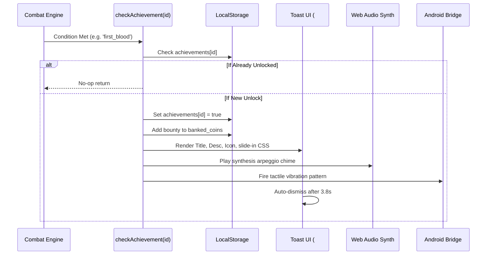

# 🏛️ Architecture: Achievement & Trophy Event Bus

This document specifies the event dispatching, reward granting, and UI toast animation lifecycle of the **Trophy Room & Achievement Subsystem**.

---

## 1. Event Flow Architecture



---

## 2. Milestone Achievement Dictionary

```typescript
interface AchievementDef {
  id: string;
  title: string;
  desc: string;
  reward: number;
  icon: string;
}
```
All definitions are centralized in `ACHIEVEMENT_DEFS` in `game.js`, ensuring zero duplicate logic between combat event triggers and modal UI renderers.
