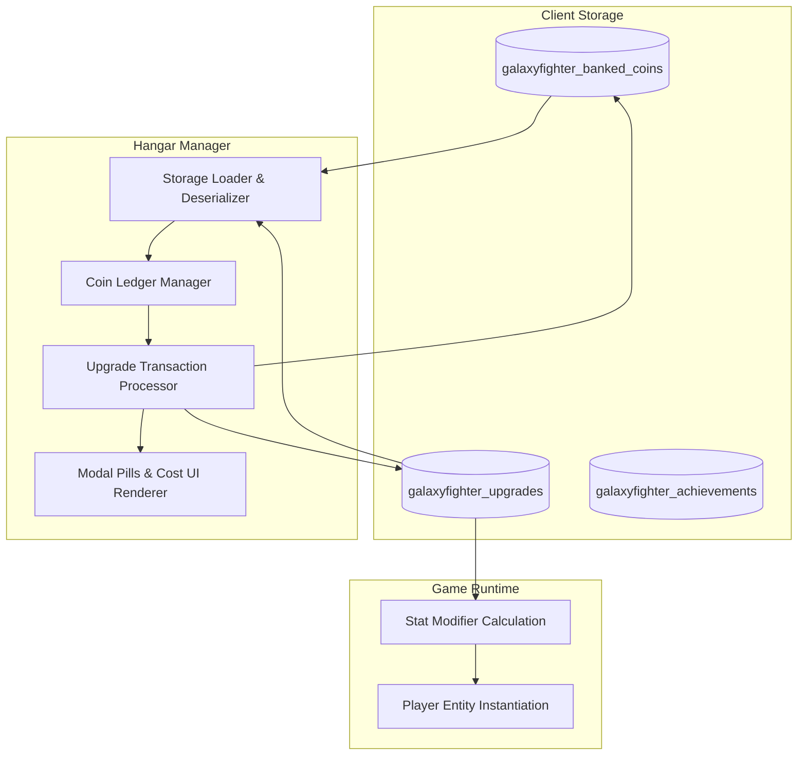

# 🏛️ Architecture: Hangar Meta-Progression & Persistence Subsystem

This document specifies the technical design, storage contracts, and upgrade resolution pipeline for the Hangar Workshop in Galaxy Fighter.

---

## 1. Subsystem Architecture



---

## 2. Storage Data Contracts

### 1. `galaxyfighter_banked_coins`
- **Type**: `String` (Base-10 Integer).
- **Semantics**: Total accumulated gold coins across all previous runs minus total spent upgrade costs.

### 2. `galaxyfighter_upgrades`
- **Type**: `String` (JSON serialized Object).
- **Schema**:
  ```typescript
  interface UpgradeState {
    mag: number;    // Level 0..2 (Capacity = 6 + mag * 2)
    speed: number;  // Level 0..2 (Speed = Base * (1 + speed * 0.18))
    power: number;  // Level 0..2 (Duration = Base + power * 3.0s)
    board: number;  // Level 0..1 (Max Hits = 1 + board)
  }
  ```

---

## 3. Transaction Safety & Edge Case Handling
- **Atomic Deduction**: Balance validation occurs synchronously before state modification.
- **Max Level Protection**: Prevents purchasing beyond array index limits (`costs[currentLvl]`).
- **Null Safety**: Graceful fallback to default `{ mag: 0, speed: 0, power: 0, board: 0 }` if storage is wiped or corrupted.
