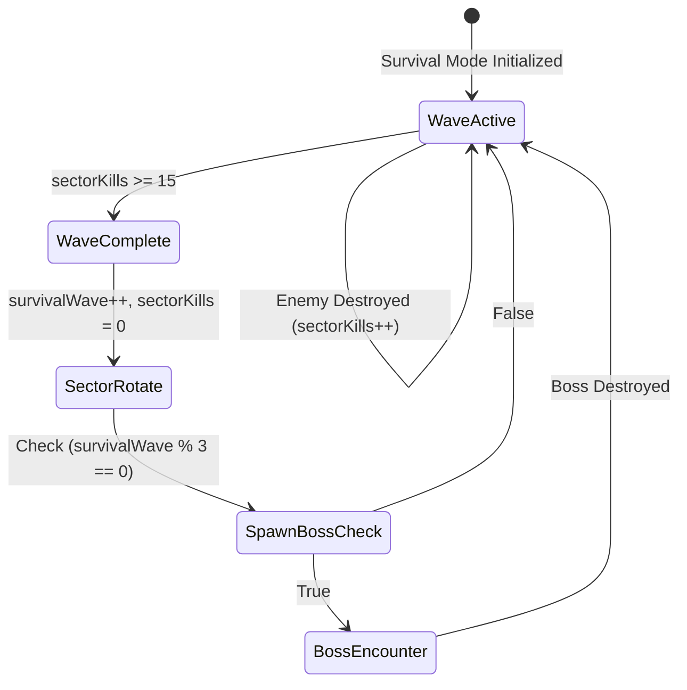

# 🏛️ Architecture: Endless Survival Wave Engine

This document outlines the state machine, difficulty scaling algorithms, and memory management of the **Endless Survival Wave Engine**.

---

## 1. Wave State Machine

---

## 2. Difficulty Scaling Formulas

As wave index $W$ increases:
- **Enemy Spawn Delay**:
  $$\text{Delay}(W) = \max\left(1.2\text{s}, 2.8\text{s} - (W \times 0.08\text{s})\right)$$
- **Heavy UFO Ratio**:
  $$P(\text{Heavy}) = \min\left(0.60, 0.20 + (W \times 0.04)\right)$$
- **Asteroid Density**:
  $$\text{Spawn Interval}(W) = \max\left(2.0\text{s}, 4.0\text{s} - (W \times 0.1\text{s})\right)$$
