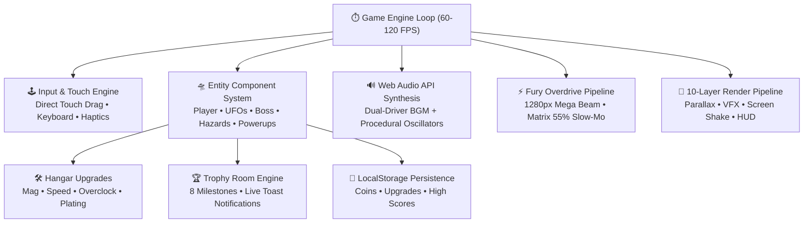

# 🏗️ Galaxy Fighter - Architecture & Engineering Specification

## 1. Engine Core & Architecture
Galaxy Fighter runs on a custom zero-dependency Canvas 2D engine optimized for 60-120 FPS execution across desktop and mobile browsers, alongside an Android Native Java bridge.

### **Component Architecture Diagram**

---

## 2. 10-Layer Render Pipeline
1. **Layer 0 - Starfield & Celestial Particles**: Procedural twinkling starfield backdrop.
2. **Layer 1 - Parallax Environment**: Dual seamless looping backgrounds (`Earth`, `Nebula`, `Cyber Void`, `Mothership`).
3. **Layer 2 - Active Hazards**: Floating asteroids with rotation and splitting physics.
4. **Layer 3 - Power-Up Collectibles**: Subway Surfers-style floating orbs with sine-wave hovering and magnet attraction.
5. **Layer 4 - Projectiles**: Player torpedoes and alien plasma fireballs.
6. **Layer 5 - Enemies & Boss**: UFOs with HP bars and multi-phase Mothership Boss entity.
7. **Layer 6 - Player Entity & Mega Beam**: Aircraft sprite with banking rotation, engine exhaust flames, hoverboard/shield overlays, and Overdrive Mega Laser beam.
8. **Layer 7 - Particle Engine**: Explosions, sparks, smoke, speed lines, lightning arcs, and debris (capped at 250 elements).
9. **Layer 8 - Floating Combat Text**: Damage, coin pickups, and combo notifications (capped at 25 elements).
10. **Layer 9 - HUD & Overlay**: Health hearts, dynamic magazine slots, Fury Overdrive gauge, coin counters, sector/wave badges, and combo meters.

---

## 3. Subsystems & Pipelines

### A. 🛠️ Hangar Meta-Progression & Persistence
- **Storage Keys**:
  - `galaxyfighter_banked_coins`: Banked currency ledger.
  - `galaxyfighter_upgrades`: JSON serialized upgrade levels `{ mag, speed, power, board }`.
  - `galaxyfighter_achievements`: JSON serialized unlock states.

### B. ⚡ Fury Overdrive & Bullet-Time Pipeline
- When `overdriveTimer > 0`, the engine splits frame delta time:
  - $\Delta t_{\text{player}} = \Delta t$ ($100\%$ full speed)
  - $\Delta t_{\text{enemies}} = \Delta t \times 0.45$ ($55\%$ bullet-time slow-mo)
- Instantaneous piercing collision checks along horizontal beam matrix ($y \pm 65\text{px}$).

### C. ♾️ Endless Survival State Machine
- Dynamic wave counter increments every 15 kills, rotating map themes and triggering periodic boss encounters on waves $3n$.

### D. 🔊 Audio & Procedural Synthesis Subsystem
- **Dual-Driver Audio**: Native HTML5 Audio for background streaming + Web Audio API `AudioContext` procedural oscillators (Rocket saw waves, Hoverboard square waves, EMP white noise, Magnet sine pulses).
