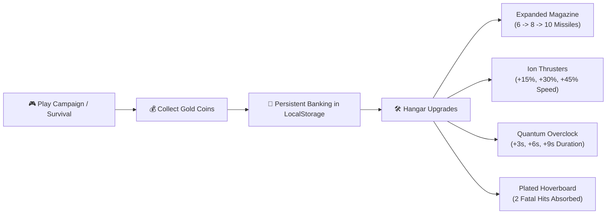

# 🌌 Galaxy Fighter - Game Design Document (GDD)

## 1. Overview
**Galaxy Fighter** is a retro-arcade 2D aerial combat and space shooter game developed with pure high-performance Web standards (HTML5 Canvas, Web Audio API, Vanilla CSS) and Solar2D Lua engine.

---

## 2. Core Gameplay Pillars
- **High-Octane Dogfighting**: Fluid vertical flight maneuvering, direct touch drag steering, and dynamic projectile combat.
- **Tactical Resource Management**: 6-to-10 round high-impact missile magazines with automated & manual tactical reload mechanisms.
- **Hangar Workshop & Meta-Progression**: Persistent gold coin banking to upgrade Magazine Size, Engine Velocity, Power-up Durations, and Reinforced Hoverboards.
- **Fury Overdrive Ultimate**: High-stakes screen-clearing Mega Laser beam paired with 55% Matrix Bullet-Time slow-mo.
- **Dual Play Modes**: Narrative 4-Sector Campaign with Multi-Phase Boss encounters and Infinite Endless Survival Mode.
- **Trophy Room**: 8 unlockable milestone achievements with coin rewards and live in-game toast notifications.

---

## 3. Power-Ups & Upgrades Synergy

| Power-Up | Type | Duration | Visual Effect | Gameplay Mechanics | Upgraded Via Hangar |
| :--- | :--- | :--- | :--- | :--- | :--- |
| 🚀 **Hyper Rocket** | Speed & Invincibility | $6.0\text{s} + \text{Bonus}$ | Huge fiery exhaust jet + speed warp lines | $+100\%$ Speed, destroys enemies on touch, auto-collects all coins | Up to $+6\text{s}$ duration |
| 🛹 **Cosmic Hoverboard** | Shield / Extra Life | Until Absorbed | Neon floating board beneath aircraft | Absorbs fatal collisions, triggers EMP shockwave | Up to **2 Fatal Crashes** |
| 🧲 **Super Magnet** | Economy | $12.0\text{s} + \text{Bonus}$ | Cyan magnetic pulse rings | Sucks all gold coins and power-ups across the screen | Up to $+6\text{s}$ duration |
| ⚡ **Triple Spread** | Weapon Boost | $10.0\text{s} + \text{Bonus}$ | Gold plasma energy trail | Fires 3 torpedoes in forward spread cone | Up to $+6\text{s}$ duration |
| 💨 **Quantum Dash** | Maneuver | Instant ($2.5\text{s}$ CD) | Ghost after-images / blue flash | Instant vertical warp dodge through enemy fire | Baseline |
| ❤️ **Hull Repair** | Health | Instant | Green cross aura | Restores $+1$ Heart/Life to maximum | Baseline |
| 💣 **Smart EMP Nuke** | Screen Clear | Instant | White screen flash + heavy boom | Wipes out all active enemies & projectiles | Baseline |

---

## 4. Hangar Workshop & Permanent Progression

---

## 5. Fury Overdrive Ultimate Ability
- **Fury Gauge Accumulation**: Charges to $100\%$ via UFO kills ($+4\%/6\%$) and coin pickups ($+3\%$).
- **Trigger**: <kbd>Q</kbd> / <kbd>E</kbd> or on-screen ⚡ HUD button.
- **Mega Death Laser Beam**: Screen-wide horizontal beam ($1280\text{px}$) piercing all enemy craft and dealing rapid DPS to the Boss.
- **Matrix Bullet-Time**: Enemies and enemy fire slow down by $55\%$ ($\Delta t \times 0.45$) during the 4.0s duration while the player is invulnerable.

---

## 6. Game Modes & Sectors

### **Mode A: 4-Sector Campaign**
- **Sector 1: Earth Stratosphere**: 10 Scout UFOs.
- **Sector 2: Solar Nebula**: 15 Interceptor UFOs & Asteroid Belts.
- **Sector 3: Cyber Void Armada**: 20 Heavy Armored UFOs.
- **Sector 4: Alien Dreadnought Mothership**: 3-Phase Boss encounter.

### **Mode B: Endless Survival Mode**
- Infinite waves scaling every 15 kills.
- Seamless celestial map transitions after each wave.
- Dreadnought Boss encounters spawn every 3rd survival wave.
