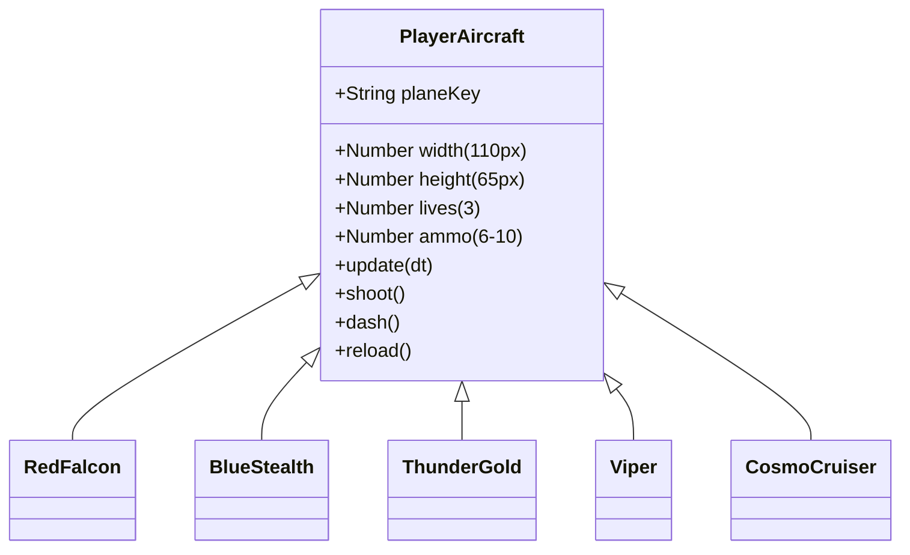

# 🛸 Feature: Playable Aircraft Fleet

Galaxy Fighter includes **5 playable starfighters**, each possessing distinct aerodynamics, engine tuning, sprite art, and combat traits.

---

## 🚀 1. Fighter Profiles & Specifications

### 1. 🔴 Red Falcon (`plane_1_red`)
- **Class**: Tactical Superiority Fighter
- **Aerodynamics**: Balanced vertical inertia with rapid muzzle alignment ($0.15\text{s}$ recovery).
- **Sprite**: `recursos/imagens/planes/plane_1/plane_1_red.png`
- **Recommended Playstyle**: General campaign progression, boss battles, and learning evasive maneuvers.

### 2. 🔵 Blue Stealth (`plane_1_blue`)
- **Class**: High-Speed Interceptor
- **Aerodynamics**: Low aerodynamic drag profile with $+10\%$ baseline speed bonus.
- **Sprite**: `recursos/imagens/planes/plane_1/plane_1_blue.png`
- **Recommended Playstyle**: Evasive speed runs, fast hazard navigation, and asteroid belt weaving.

### 3. 🟡 Thunder Gold (`plane_1_yellow`)
- **Class**: Heavy Plasma Assault
- **Aerodynamics**: Heavy thrusters with wider lateral plasma discharge cones ($+15\%$ blast area).
- **Sprite**: `recursos/imagens/planes/plane_1/plane_1_yellow.png`
- **Recommended Playstyle**: Swarm clearing in Sector 2/3 and Endless Survival waves.

### 4. 🟢 Viper (`plane_2_green`)
- **Class**: Advanced Recon Fighter
- **Aerodynamics**: Integrated gravitational coils with $+25\%$ magnetic pull radius for gold coins and power-ups.
- **Sprite**: `recursos/imagens/planes/plane_2/plane_2_green.png`
- **Recommended Playstyle**: Coin farming runs, fast Hangar upgrades, and high-economy playthroughs.

### 5. 🔷 Cosmo Cruiser (`plane_3_blue`)
- **Class**: Heavy Galactic Battleship
- **Aerodynamics**: Reinforced hull plating with $+1$ native bonus missile magazine capacity.
- **Sprite**: `recursos/imagens/planes/plane_3/plane_3_blue.png`
- **Recommended Playstyle**: Sustained combat barrage and multi-phase Alien Mothership takedowns.

---

## 🕹️ 2. Aircraft Selection UI
Pilots select their active fighter directly from the title screen modal (`.plane-card`), dynamically updating the engine's `selectedPlaneKey`.
