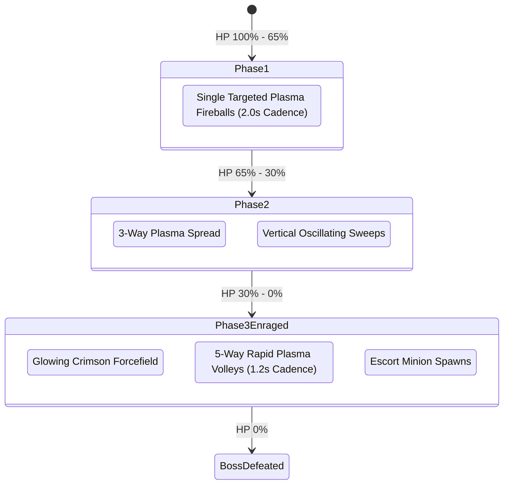

# 👾 Feature: Alien Mothership Boss Encounter

The **Alien Dreadnought Mothership** is the multi-phase climax of Sector 4 and appears periodically every 3rd wave in Endless Survival Mode.

---

## 🛡️ 1. Boss Entity Attributes
- **Dimensions**: $250\text{px} \times 190\text{px}$.
- **Hit Points**:
  - Normal Difficulty: $35\text{ HP}$
  - Veteran Difficulty: $45\text{ HP}$
  - Insane Difficulty: $55\text{ HP}$
- **HUD Boss Bar**: $480\text{px}$ gradient energy bar rendered at the top center with dynamic phase labeling (`MOTHERSHIP BOSS [ENRAGED PHASE]: 14 / 45`).

---

## 💥 2. Boss Combat Strategies
- **Hyper Rocket Ramming**: Ramming the Boss with Hyper Rocket active deals a massive **$5\text{ damage burst}$** per pass.
- **Overdrive Mega Laser**: Concentrated beam delivers **$10\text{ damage/second}$** continuous thermal cutting.
- **Victory Bounty**: Defeating the Mothership grants $+5000$ points, $+500$ Gold Coins via the *Mothership Slayer* achievement, and triggers the Campaign Victory sequence.
