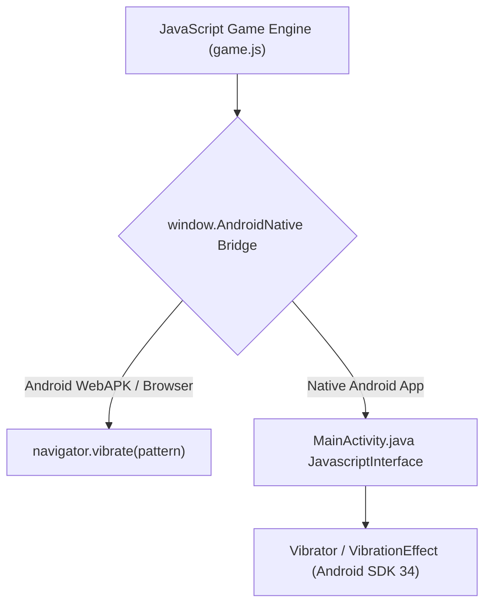

# 📱 Feature: Android Native Bridge & PWA Architecture

Galaxy Fighter provides **dual Android deployment options**: a lightweight, installable **PWA WebAPK** and a native **Android Studio Java/Gradle application**.

---

## 🏛️ 1. Architecture & Hardware Bridge



---

## 📦 2. Android Studio Project Architecture (`android/`)
- **Target SDK**: Android 14 (API Level 34).
- **Min SDK**: Android 7.0 (API Level 24).
- **Hardware Acceleration**: Enabled via `android:hardwareAccelerated="true"` in `AndroidManifest.xml`.
- **Immersive Fullscreen**: Sticky immersive mode hides system status and navigation bars automatically.
- **Haptic Bridge Method**:
  ```java
  @JavascriptInterface
  public void vibrate(long milliseconds) {
      if (vibrator != null && vibrator.hasVibrator()) {
          vibrator.vibrate(VibrationEffect.createOneShot(milliseconds, VibrationEffect.DEFAULT_AMPLITUDE));
      }
  }
  ```
