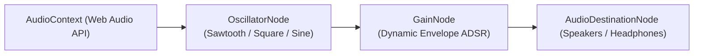

# 🔊 Feature: Procedural Audio Synthesis Engine

Galaxy Fighter combines native HTML5 Audio streams with a high-performance **Web Audio API procedural sound synthesis engine** to generate latency-free dynamic combat audio.

---

## 🎛️ 1. Audio Architecture & Synthesis Graph

---

## 🎵 2. Synthesized Procedural Sound Effects

| Sound Effect | Oscillator Type | Frequency Curve | Envelope ADSR | Combat Trigger |
| :--- | :---: | :--- | :--- | :--- |
| **🚀 Hyper Rocket** | Sawtooth | $80\text{Hz} \to 600\text{Hz}$ (Exp) | $0.4 \to 0.001$ over $0.5\text{s}$ | Jetpack Pickup / Thruster Ignition |
| **🛹 Cosmic Hoverboard** | Square | $220\text{Hz} \to 440\text{Hz}$ | $0.3 \to 0.001$ over $0.4\text{s}$ | Hoverboard Shield Equip |
| **🧲 Super Magnet** | Sine | $440\text{Hz} \to 880\text{Hz}$ | $0.2 \to 0.001$ over $0.3\text{s}$ | Magnetic Coin Attraction |
| **💨 Quantum Dash** | Triangle | $300\text{Hz} \to 120\text{Hz}$ | $0.35 \to 0.001$ over $0.2\text{s}$ | Warp Dash Dodge |
| **💣 Smart EMP Nuke** | White Noise + Sawtooth | $120\text{Hz} \to 40\text{Hz}$ | $0.5 \to 0.001$ over $0.8\text{s}$ | Screen-clearing Nuke Explosion |
| **✨ Powerup Chime** | Sine Arpeggio | $523\text{Hz} \to 659\text{Hz} \to 784\text{Hz}$ | $0.3 \to 0.001$ over $0.45\text{s}$ | Power-up Pickup / Upgrade Buy |
