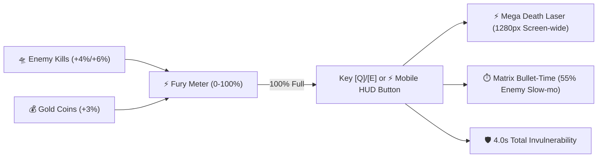

# ⚔️ Combat Mechanics, Weapon Systems & Fury Overdrive

Galaxy Fighter incorporates dynamic combat loops featuring tactical magazine reloads, combo scoring chains, subway-style arcade power-ups, and the **Fury Overdrive Ultimate Ability**.

---

## ⚡ 1. Fury Overdrive Ultimate Ability

The **Fury Overdrive** is the supreme tactical ability in the pilot's arsenal.

### Key Overdrive Attributes
- **Charging Equation**:
  - Scout UFO Kill: $+4\%$ Fury
  - Heavy UFO Kill: $+6\%$ Fury
  - Asteroid Vaporization: $+4\%$ Fury
  - Gold Coin Collected: $+3\%$ Fury
- **Mega Death Laser Beam**:
  - Width: Entire viewport ($1280\text{px}$).
  - Height: $64\text{px}$ beam with a $20\text{px}$ super-heated white-hot core.
  - Particle Emissions: Dual-color cyan and amber lightning sparks ($60\text{fps}$).
  - Penetration: $100\%$ Piercing. Instantly vaporizes all normal UFOs and Asteroids in the lane.
  - Boss DPS: Continuous $10\text{ HP/second}$ thermal cutting damage against the Alien Dreadnought.
- **Matrix Bullet-Time**:
  - Slows down all enemy velocities, sine oscillations, and enemy projectile speeds by **$55\%$ slow-mo** ($\Delta t \times 0.45$).
- **Total Invulnerability**: The player is completely immune to collision and projectile damage during the 4.0s active state.

---

## 🎯 2. Tactical Magazine System
- **Capacity**: 6 missiles baseline, expandable up to **10 missiles** via Hangar Upgrades.
- **Auto-Reload**: Automatically triggers a 1.0s reload sequence with circular HUD progress arc and audio clicks when the last missile is expended.
- **Manual Reload**: Can be triggered anytime via <kbd>R</kbd>, <kbd>K</kbd>, <kbd>C</kbd>, or the on-screen <kbd>○</kbd> circle button.

---

## 🔥 3. Combat Combo Multiplier System
- Eliminating multiple UFOs within a 2.8s window builds a **Combat Combo Multiplier**:
  $$\text{Score Multiplier} = \min(5, \text{Combo Streak})$$
- Scoring Scale:
  - Scout UFO: $150 \times \text{Multiplier}$ ($150 \to 750\text{ pts}$)
  - Heavy UFO: $300 \times \text{Multiplier}$ ($300 \to 1500\text{ pts}$)
- Taking damage or allowing the timer to expire resets the combo streak to zero.

---

## 👾 4. Multi-Phase Boss Battle Mechanics
- **Phase 1 (100% – 65% HP)**: Precision targeted single plasma fireballs every 2.0s.
- **Phase 2 (65% – 30% HP)**: 3-way spread fireballs + vertical evasive sweeps + drone support.
- **Phase 3 (30% – 0% HP)**: **Enraged Mode** with pulsing red barrier, 5-way spread barrage every 1.2s, and accelerated movement.
