# 🔥 Feature: Combo Multipliers & Score Architecture

Galaxy Fighter utilizes an aggressive **Combat Combo Multiplier System** designed to reward skilled pilots who eliminate threats in rapid, uninterrupted sequences.

---

## 📈 1. Combo Mechanics & Scoring Scale

```mermaid
graph LR
    Kill1["🛸 Kill 1 (Combo x1)"] -->|Within 2.8s| Kill2["🛸 Kill 2 (Combo x2)"]
    Kill2 -->|Within 2.8s| Kill3["🛸 Kill 3 (Combo x3)"]
    Kill3 -->|Within 2.8s| Kill4["🛸 Kill 4 (Combo x4)"]
    Kill4 -->|Within 2.8s| Kill5["🛸 Kill 5 (Combo x5 MAX 🔥)"]
    Kill5 -->|Taking Damage / Timer Expired| Reset["💥 Combo Reset to 0"]
```

### Score Scaling Table

| Threat Type | Base Score | Combo x2 | Combo x3 | Combo x4 | Combo x5 (MAX) |
| :--- | :---: | :---: | :---: | :---: | :---: |
| **Scout UFO** | $150\text{ pts}$ | $300\text{ pts}$ | $450\text{ pts}$ | $600\text{ pts}$ | **$750\text{ pts}$** |
| **Heavy Armored UFO** | $300\text{ pts}$ | $600\text{ pts}$ | $900\text{ pts}$ | $1200\text{ pts}$ | **$1500\text{ pts}$** |
| **Space Asteroid** | $80\text{ pts}$ | $80\text{ pts}$ | $80\text{ pts}$ | $80\text{ pts}$ | $80\text{ pts}$ |
| **Alien Dreadnought Boss** | $5000\text{ pts}$ | $5000\text{ pts}$ | $5000\text{ pts}$ | $5000\text{ pts}$ | $5000\text{ pts}$ |

---

## ⏱️ 2. Combo Timer Decay & Visuals
- **Decay Window**: Every kill resets the combo decay timer to **$2.8\text{s}$** (`gameState.comboTimer = 2.8`).
- **HUD Indicator**: The active combo streak is displayed with a fiery badge (`COMBO x5 🔥`) on the top right HUD.
- **Floating Combat Text**: Each destroyed enemy spawns floating point text showing the earned value and active multiplier in amber gold (`#fbbf24`).
