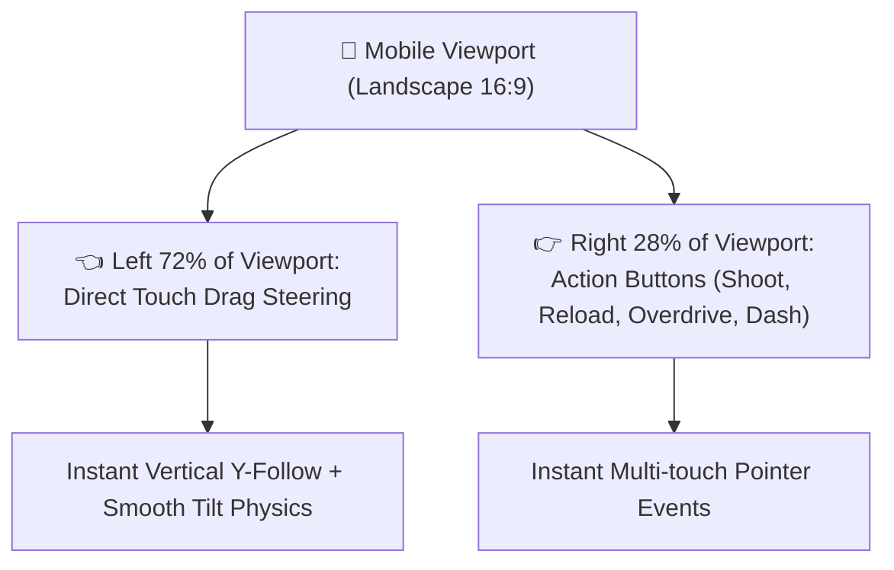

# 📱 Feature: Direct Touch Drag Steering & Mobile Ergonomics

Galaxy Fighter provides tailored mobile controls featuring zero-latency **Direct Canvas Touch Drag Steering** and accessible on-screen action buttons.

---

## 🕹️ 1. Multi-Touch Control Layout

---

## ⚡ 2. Direct Touch Drag Algorithm
- When a touch begins on the left $72\%$ of the canvas (`touchX < CANVAS_WIDTH * 0.72`):
  1. Touch coordinates are mapped to Canvas 2D virtual coordinate space ($1280 \times 720$).
  2. `touchTargetY` is updated continuously at $60\text{fps}$.
  3. The aircraft moves smoothly towards the touch target with spring easing:
     $$y \mathrel{+}= (y_{\text{target}} - y) \times 0.22$$
  4. Aircraft tilt angle adjusts realistically with vertical velocity:
     $$\text{tilt} = \text{clamp}(-0.25, 0.25, (y_{\text{target}} - y) \times 0.015)$$
- Prevents awkward D-pad slipping and delivers tactile 1:1 control.
