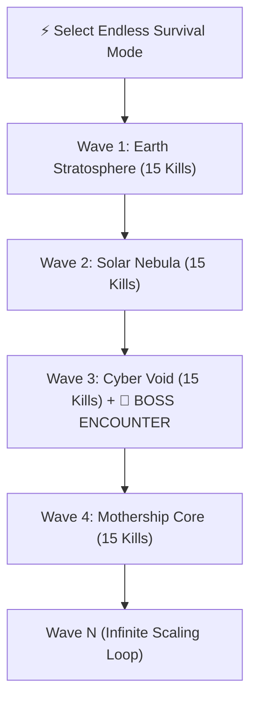

# ♾️ Feature: Endless Survival Mode

**Endless Survival Mode** is a dedicated infinite game mode in Galaxy Fighter engineered for endless replayability, escalating challenge, and high-score competitive dominance.

---

## 🌊 1. Infinite Wave Progression
- **Wave Transition Threshold**: Each wave requires exactly **15 confirmed enemy kills** to complete.
- **Wave Completion Bounty**:
  - $+800$ Bonus Combat Points
  - Screen-wide transition announcement: `⚡ SURVIVAL WAVE [N] INCOMING! ⚡`
  - Audio fanfare synthesis (`playSynthSound('powerup')`).

---

## 🔄 2. Dynamic Celestial Map Rotation
Every wave completion smoothly shifts the celestial backdrop through the 4 galactic regions:
1. `sky_background_mountains.png` (Earth Stratosphere)
2. `bg_solar_nebula.jpg` (Solar Nebula Dust)
3. `bg_cyber_void.jpg` (Cyber Void Starfield)
4. `bg_alien_mothership.jpg` (Mothership Core)
5. *Loops back seamlessly to Earth with increased difficulty multipliers!*

---

## 👾 3. Periodic Mothership Boss Raids
- Every 3rd survival wave ($\text{Wave } 3, 6, 9, 12, 15, \dots$), an **Alien Dreadnought Boss** warps directly into the combat arena.
- In survival mode, Boss max health and attack cadence scale dynamically with the wave number tier.
