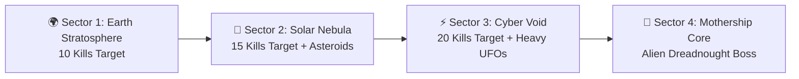

# 🗺️ Feature: 4-Sector Narrative Campaign

Galaxy Fighter includes a structured **4-Sector Campaign** following the pilot's mission from Earth's upper atmosphere to the heart of the alien invasion dreadnought.

---

## 🌌 1. Sector Progression & Kill Targets

| Sector | Celestial Map | Kill Requirement | Hostile Threats | Environmental Modifiers |
| :--- | :--- | :---: | :--- | :--- |
| **Sector 1** | 🌍 **Earth Stratosphere** | 10 Kills | OVNI Scout UFOs | Alpine mountains, baseline movement physics. |
| **Sector 2** | 🌌 **Solar Nebula** | 15 Kills | Interceptor UFOs + Asteroids | Stardust fog, floating asteroids, enemy plasma return fire. |
| **Sector 3** | ⚡ **Cyber Void** | 20 Kills | Heavy Armored UFOs (5 HP) | Deep space void, dual enemy lasers, dense asteroid belts. |
| **Sector 4** | 👾 **Alien Mothership** | Boss Defeat | Alien Dreadnought Boss (50 HP) | Reactor core lightning storm, multi-phase boss fight. |

---

## 🌟 2. Hyperspace Jump Transitions
Upon meeting the sector kill target:
- Screen-wide banner announcement: `🌟 SECTOR CLEARED! HYPERSPACE JUMP -> [SECTOR_NAME] 🌟`
- Background scrolling speed triples for 3.5 seconds.
- Score bonus of $+500$ awarded.
- Synthesized hyperspace warp audio effect.
