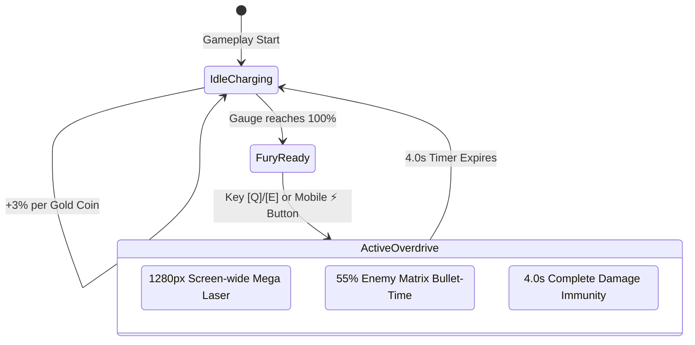

# ⚡ Feature: Fury Overdrive Ultimate Ability

The **Fury Overdrive** is the flagship ultimate combat mechanic in Galaxy Fighter, designed to turn the tide of high-density alien dogfights.

---

## ⚡ 1. Charging Engine Mechanics
- **Fury Gauge Storage**: `gameState.fury` stored as an integer value from `0` to `100`.
- **Accumulation Formulas**:
  $$\Delta \text{Fury} = \begin{cases} +4 & \text{Scout UFO Destroyed} \\ +6 & \text{Heavy UFO Destroyed} \\ +4 & \text{Asteroid Shattered} \\ +3 & \text{Gold Coin Collected} \end{cases}$$
- **Ready State**: When `gameState.fury >= 100`, the mobile ⚡ button pulses with high-contrast amber/cyan glow animations, and the desktop HUD prompts `⚡ FURY READY! [Q/E]`.

---

## 💥 2. Mega Death Laser Beam Specs
- **Beam Dimensions**: Horizontal beam spanning $x = \text{player.x} + 40$ to $x = 1280\text{px}$, with a $64\text{px}$ gradient energy aura and a $20\text{px}$ white-hot thermal core.
- **Particle System**: Emits dual-frequency cyan (`#38bdf8`) and gold (`#fbbf24`) lightning discharges along the beam path.
- **Collision & DPS**:
  - Regular UFOs & Asteroids: Instant vaporization on touch.
  - Alien Mothership Boss: Continuous $10\text{ damage/second}$ sustained thermal cutting.

---

## ⏱️ 3. Matrix Bullet-Time Slow-Mo
- When activated, all alien craft velocities, projectile trajectories, and oscillation frequencies are scaled down by **$55\%$ slow-mo** ($\Delta t_{\text{entities}} = \Delta t \times 0.45$).
- The player aircraft retains $100\%$ full maneuverability and instant warp responsiveness.
