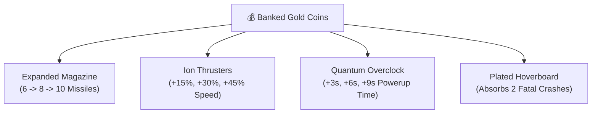

# 🛸 Hangar Workshop, Aircrafts & Permanent Upgrades

Galaxy Fighter features a comprehensive **Hangar Workshop** allowing pilots to customize their ships and permanently upgrade aircraft systems using banked gold coins across play sessions.

---

## ✈️ Playable Fighter Fleet

Galaxy Fighter includes 5 distinct playable aircraft with unique tactical profiles and aerodynamics:

| Fighter | Color / Sprite | Tactical Profile | Special Trait |
| :--- | :--- | :--- | :--- |
| **Red Falcon** | Red (`plane_1_red`) | All-Round Balanced Fighter | Rapid muzzle recovery and balanced vertical banking. |
| **Blue Stealth** | Blue (`plane_1_blue`) | Aerodynamic Interceptor | $+10\%$ base thruster speed and tighter evasive hitbox. |
| **Thunder Gold** | Yellow (`plane_1_yellow`) | Heavy Plasma Assault | Wider torpedo muzzle flash and $+15\%$ blast radius. |
| **Viper** | Green (`plane_2_green`) | Precision Recon | $+25\%$ magnetic pull radius for coins and drops. |
| **Cosmo Cruiser** | Dark Blue (`plane_3_blue`) | Heavy Dreadnought Cruiser | $+1$ bonus starting magazine capacity and reinforced hull. |

---

## 🛠️ Hangar Workshop & Permanent Upgrades

Gold coins collected during Campaign and Survival runs are permanently banked into `localStorage.galaxyfighter_banked_coins`. Pilots can invest banked coins into 4 persistent upgrade tracks:



### 1. 🎯 Expanded Magazine
- **Effect**: Increases baseline missile capacity before reload is required.
- **Formula**: $\text{Capacity} = 6 + (\text{Level} \times 2)$
- **Level 0**: 6 Missiles (Default)
- **Level 1 (100 🪙)**: 8 Missiles
- **Level 2 (250 🪙)**: 10 Missiles (**MAX**)

### 2. 🚀 Ion Thrusters
- **Effect**: Boosts aircraft vertical movement speed and evasive response.
- **Formula**: $\text{Speed} = \text{BASE\_SPEED} \times (1.0 + \text{Level} \times 0.18)$
- **Level 0**: $1.0\times$ (Default $7.2\text{px/frame}$)
- **Level 1 (150 🪙)**: $+18\%$ Engine Speed
- **Level 2 (300 🪙)**: $+36\%$ Engine Speed (**MAX**)

### 3. ⏱️ Quantum Overclock
- **Effect**: Extends the active duration of Hyper Rocket, Super Magnet, Triple Spread, and Rapid Fire power-ups.
- **Formula**: $\text{Bonus Duration} = \text{Level} \times 3.0\text{s}$
- **Level 0**: Standard Durations (Rocket 6s, Magnet 12s, Spread 10s)
- **Level 1 (120 🪙)**: $+3.0\text{s}$ to all power-up durations
- **Level 2 (260 🪙)**: $+6.0\text{s}$ to all power-up durations (**MAX**)

### 4. 🛹 Plated Hoverboard
- **Effect**: Re-engineers the Cosmic Hoverboard shield with reinforced nanite plating, allowing it to absorb multiple fatal collisions before breaking.
- **Formula**: $\text{Max Hits} = 1 + \text{Level}$
- **Level 0**: 1 Crash Hit Absorbed (Standard)
- **Level 1 (200 🪙)**: **2 Fatal Crash Hits Absorbed** (**MAX**)

---

## 💾 Local Storage Persistence Schema

```json
{
  "galaxyfighter_banked_coins": "450",
  "galaxyfighter_upgrades": {
    "mag": 2,
    "speed": 2,
    "power": 2,
    "board": 1
  }
}
```
