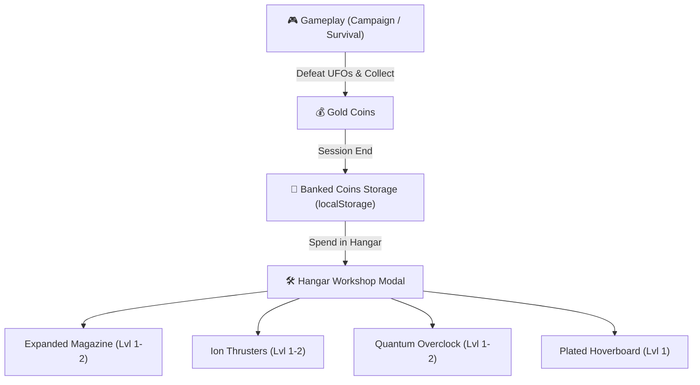

# 🛠️ Feature: Hangar Workshop & Currency Economy

The **Hangar Workshop** is the central meta-progression system of Galaxy Fighter, providing persistent aircraft augmentations across game sessions.



---

## 💰 1. Coin Economy & Banking
- **Earn Rate**:
  - Scout UFO: $+1$ Gold Coin
  - Heavy Armored UFO: $+2$ Gold Coins
  - Coin Magnet Pickups: Instant sweep of all coins on screen
  - Achievement Bounties: $+50$ to $+500$ Gold Coins per trophy
- **Persistence**: Total currency is banked automatically upon game over or victory into `localStorage.galaxyfighter_banked_coins`.
- **Top HUD Display**: Active coin balance is shown in real-time on the top navigation bar (`#topCoinCount`).

---

## 🔧 2. Upgrade System Specifications

| Upgrade Track | Icon | Level 0 (Base) | Level 1 (Cost) | Level 2 (Cost) | Max Level |
| :--- | :---: | :--- | :--- | :--- | :---: |
| **Expanded Magazine** | 🎯 | 6 Missiles | 8 Missiles (100 🪙) | 10 Missiles (250 🪙) | Lvl 2 |
| **Ion Thrusters** | 🚀 | $7.2\text{px/frame}$ ($1.0\times$) | $+18\%$ Speed (150 🪙) | $+36\%$ Speed (300 🪙) | Lvl 2 |
| **Quantum Overclock** | ⏱️ | Baseline Durations | $+3.0\text{s}$ to all buffs (120 🪙) | $+6.0\text{s}$ to all buffs (260 🪙) | Lvl 2 |
| **Plated Hoverboard** | 🛹 | 1 Crash Hit | 2 Crash Hits (200 🪙) | — | Lvl 1 |

---

## 📊 3. State & Mathematical Modeling

```javascript
// Upgrade level lookup
const magCapacity = MAGAZINE_CAPACITY + (upgrades.mag * 2);
const engineSpeed = PLAYER_BASE_SPEED * (1.0 + upgrades.speed * 0.18);
const powerupBonus = upgrades.power * 3.0;
const hoverboardMaxHits = 1 + (upgrades.board >= 1 ? 1 : 0);
```
