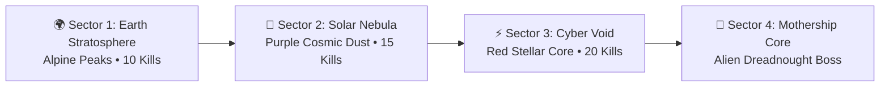

# 🌌 Maps, Environments & Endless Survival Mode

Galaxy Fighter offers dual gameplay modes: the narrative **4-Sector Campaign** and the infinite **Endless Survival Mode**.

---

## 🗺️ The 4 Celestial Sectors

| Sector | Name | Background Asset | Enemies & Hazards | Target Objective |
| :--- | :--- | :--- | :--- | :--- |
| **Sector 1** | 🌍 **Earth Stratosphere** | `sky_background_mountains.png` | Standard Scout UFOs | Eliminate 10 Scout UFOs |
| **Sector 2** | 🌌 **Solar Nebula** | `bg_solar_nebula.jpg` | Fast Interceptor UFOs + Asteroid Belt | Eliminate 15 Interceptors |
| **Sector 3** | ⚡ **Cyber Void** | `bg_cyber_void.jpg` | Heavy Armored UFOs + Asteroids | Eliminate 20 Heavy UFOs |
| **Sector 4** | 👾 **Alien Mothership** | `bg_alien_mothership.jpg` | Multi-phase Alien Dreadnought Boss | Defeat the Boss Mothership |

---

## ♾️ Endless Survival Mode

In **Endless Survival Mode**, pilots face an unending alien invasion where difficulty scales dynamically with every wave.

### Survival Mode Rules & Mechanics
1. **Infinite Waves**: Each wave requires **15 alien kills** to advance to the next tier.
2. **Dynamic Map Rotation**: The celestial environment seamlessly cycles every wave ($\text{Earth} \to \text{Solar Nebula} \to \text{Cyber Void} \to \text{Mothership}$).
3. **Scaling Hazard Density**: Asteroid spawn frequencies and heavy UFO spawn rates scale with wave tier.
4. **Periodic Mothership Encounters**: Every 3rd wave ($\text{Wave } 3, 6, 9, 12, \dots$), an **Alien Dreadnought Boss** warps into combat!
5. **Score Bounties**: Completing each survival wave grants $+800$ bonus combat points and banked coin multipliers.
