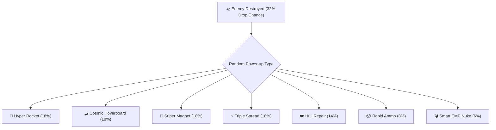

# ⚡ Feature: Subway Surfers-Style Arcade Power-Ups

Galaxy Fighter features **7 collectible arcade power-ups** inspired by high-octane endless runner mechanics, engineered with distinct VFX, procedural synthesis audio, and game-changing combat mechanics.

---

## 🎁 1. Power-Up Roster & Mechanics

### 1. 🚀 Hyper Rocket Boost (Jetpack Mode)
- **Base Duration**: $6.0\text{s}$ ($+3.0\text{s}$ per Hangar Overclock tier).
- **Effect**: $+100\%$ Flight speed, total invulnerability, dynamic speed warp lines, and instant ram-kill destruction on all enemy contact.
- **Audio**: Procedural exponential sawtooth whoosh ($80\text{Hz} \to 600\text{Hz}$).

### 2. 🛹 Cosmic Hoverboard (Surfer Shield)
- **Base Duration**: Active until impact (Up to **2 Fatal Crashes** with Plated Hoverboard upgrade).
- **Effect**: Renders a glowing neon surfboard underneath the aircraft. Absorbs fatal crashes, detonates in an EMP shockwave, and keeps life hearts intact!
- **Audio**: Procedural square-wave power chord synthesis.

### 3. 🧲 Super Coin Magnet
- **Base Duration**: $12.0\text{s}$ ($+3.0\text{s}$ per Hangar Overclock tier).
- **Effect**: Emits high-frequency gravitational magnetic pulses ($900\text{px}$ screen radius) pulling all gold coins and power-ups directly into the ship.
- **Audio**: Procedural modulated sine-wave attractor chime.

### 4. ⚡ Triple Spread Plasma Cannon
- **Base Duration**: $10.0\text{s}$ ($+3.0\text{s}$ per Hangar Overclock tier).
- **Effect**: Converts single torpedoes into a 3-way plasma spread covering top, middle, and bottom screen lanes.

### 5. 💨 Quantum Warp Dash
- **Cooldown**: $2.5\text{s}$. Triggered via <kbd>Shift</kbd> or on-screen Dash button.
- **Effect**: Instant vertical warp dodge through bullet curtains leaving ghost after-image holograms with $0.6\text{s}$ invulnerability.

### 6. 💣 Tactical Smart Nuke
- **Trigger**: Instant on pickup.
- **Effect**: High-intensity screen shake (24 units) and white flash, clearing all active alien UFOs and projectiles from the screen.

### 7. ❤️ Hull Repair Kit
- **Trigger**: Instant on pickup.
- **Effect**: Restores $+1$ Heart to current health pool (up to max 3 hearts).
