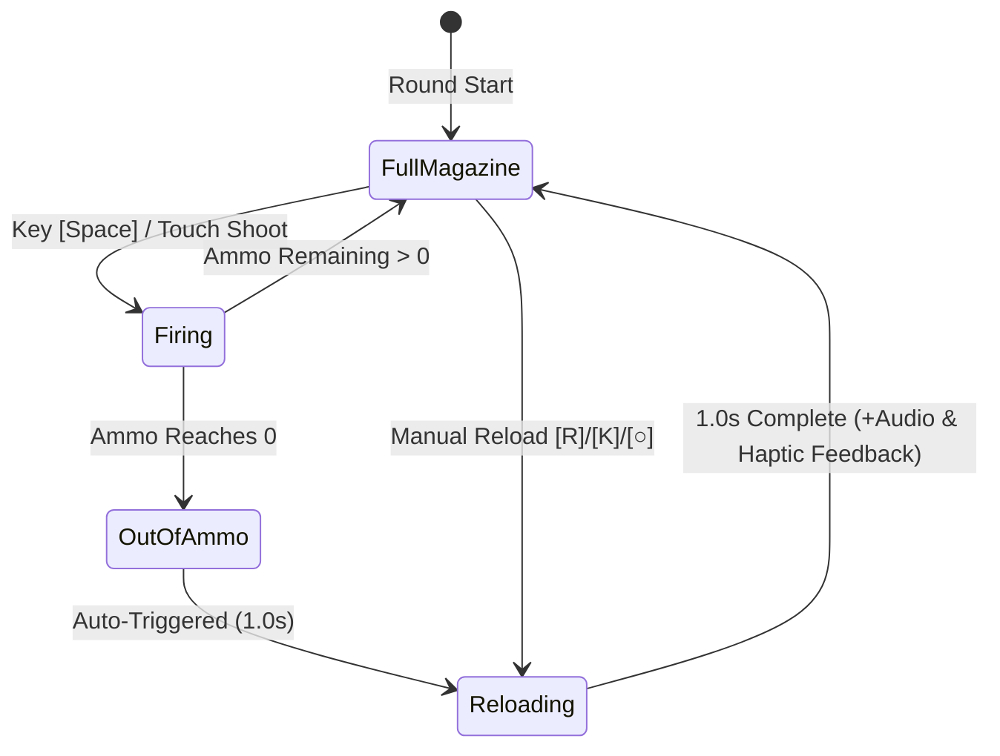

# 📦 Feature: Tactical Magazine & Reloading System

Galaxy Fighter implements a tactical **6-to-10 Round Magazine System** to elevate arcade dogfighting beyond mindless button-mashing into rhythmic resource management.

---

## 🎯 1. Magazine Architecture

---

## ⚙️ 2. Key Technical Specifications
- **Base Ammo Capacity**: 6 Rounds.
- **Hangar Expansion**: Upgradable to **8 Rounds** (Level 1) and **10 Rounds** (Level 2).
- **Reload Duration**: Exactly $1.0\text{s}$ (`RELOAD_TIME = 1.0`).
- **Visual Feedback**:
  - Top HUD Magazine Bar: Individual missile slots with active/spent transparency.
  - Aircraft Center Arc: A dynamic amber circle progress indicator rendered around the aircraft sprite during active reloading.
  - Prompts: Clear floating text and HUD instructions (`PRESS [R] / [○] TO RELOAD!`).
- **Audio Feedback**: Procedural dual mechanical clicks and haptic pulse upon reload completion.
